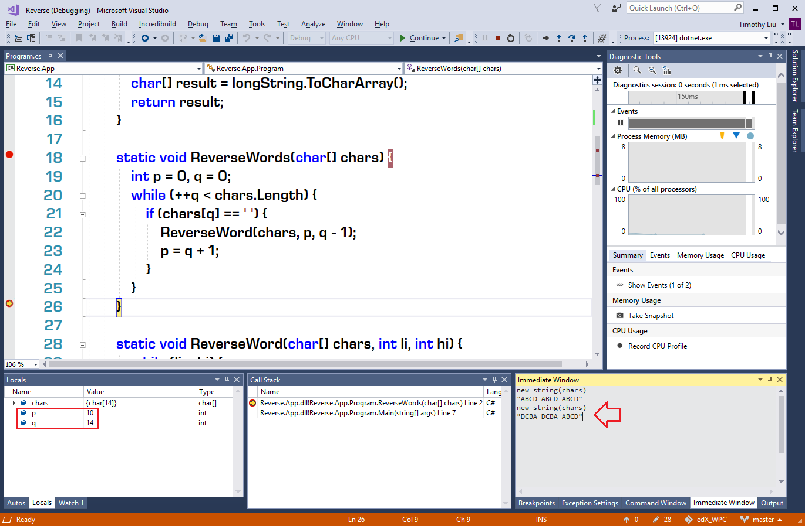
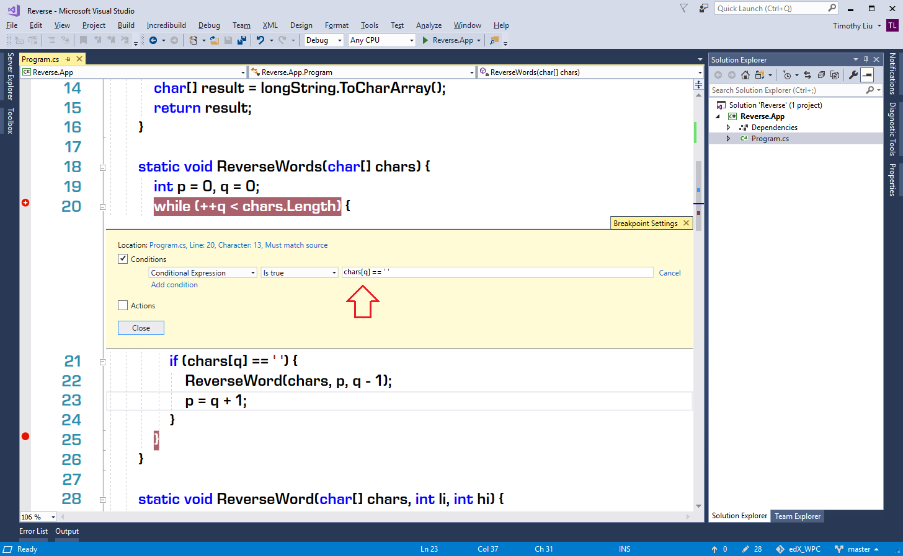
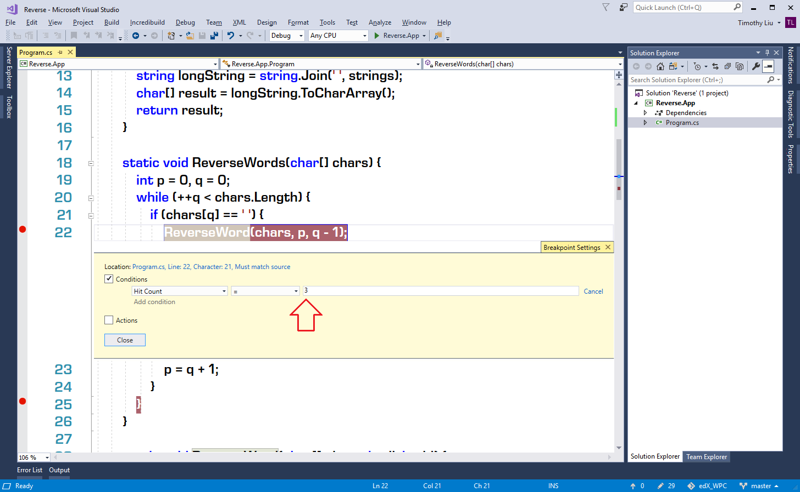
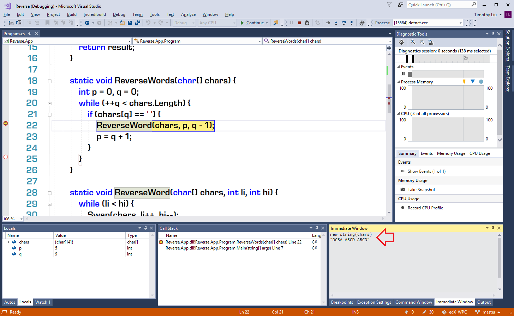
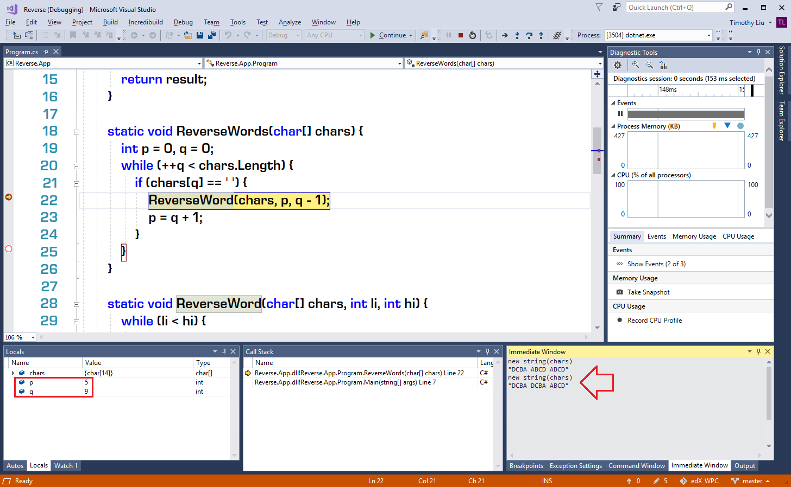

# Tutorial Lab - Fix the ```ReverseWords``` Function #

## Lab Overview ##

During the process of fixing the ```ReverseWord``` function, we learned the skills of:
* Setting breakpoints
* Starting, stopping, and restarting the execution
* Observing the status of the application
* Using debug tools such like Locals, Call Stack, and Immediate window
* Stepping over or stepping into a line of code

We still have a bug not fixed yet - the last word is not reversed. Now, it's a good time for you to apply the skills you learned from the course to fix that bug.

## Lab Guideline ##

### Start Point Project ###

The start point project is in the file ```Start.zip```, it's equivalent to the project in the file ```Step01.zip``` of the lesson content.

Extract the project from ```Start.zip``` and open the project with Visual Studio Community 2017. Then, use the code below to expose the bug:

```CS
static void Main(string[] args) {
    char[] chars = "ABCD ABCD ABCD".ToCharArray();
    ReverseWords(chars);
    string actual = new string(chars);
    Console.WriteLine(actual);
}
```

Run the application. The output is:

```
DCBA DCBA ABCD
```

So, we confirmed the bug by reproducing it.

### Debugging the Code ###

Set breakpoints at line 18 and line 26. Start debugging, and then observe the application status at line 18 and line 26. Especially, you should observe the changes of ```p``` and ```q```. Also, you should confirm the string generated from ```chars``` changed from ```"ABCD ABCD ABCD"``` to ```"DCBA DCBA ABCD"``` (the last word is not reversed):



Then, move the breakpoints to line 20 and line 25. The scope of the bug is shrunk. Start debugging. When the execution head hits the breakpoint on line 20, press <kbd>F10</kbd> to step over the ```if``` statement in the body of the ```while``` statement. Soon you will find that for most of the values of ```q```, the execution won't enter the true branch of the ```if``` statement since the value of ```chars[q]``` is not space character (```' '```). Or say, in most of the cases the result value of the condition ```chars[q] == ' '``` is ```false```. To make the debugging more efficient and accelerate the debugging process, we should not pause the execution until it's worth it we observe the application's status. To do this, we have two options, and they are equivalent:
1. Convert the breakpoint on line 20 from a common breakpoint to a *conditional breakpoint*.
2. Move the breakpoint on line 20 to line 22.

To adopt the first option, right-click the breakpoint icon on line 20, then click the <kbd>Conditions...</kbd> item in the context menu. Then select the ```Conditional Expression``` in the dropdown list as the condition type, and set the condition expression to ```chars[q] == ' '``` (the same condition as the ```if``` statement's), and keep the trigger value to be ```Is True```.



To adopt the second option, move the breakpoint from line 20 to line 22. Further, right-click the breakpoint and click <kbd>Conditions...</kbd>. This time, let's select ```Hit Count``` as the condition type and set the trigger condition to ```=``` and ```3```, since we want to know what will happen when reverting the third word.



Let's adopt the second solution (since it's more efficient) and right-click the breakpoint icon on line 25 then click <kbd>Disable Breakpoint</kbd> item in the context menu. Start the debugging. We saw the output window flashed and disappeared quickly. That means the application executed but the breakpoint was not hit. Or say, the program logic didn't reverse the third word at all.

Right-click the conditional breakpoint and adjust the trigger condition to ```=``` and ```2```. Start the debugging again. This time, the breakpoint is triggered. Evaluate the expression ```new string(chars)``` in the Immediate window, we get the value ```"DCBA ABCD ABCD"``` - the first word has been reversed and the second word is going to be reversed.



Press <kbd>F11</kbd> to step into the ```ReverseWord``` function. Since the ```ReverseWord``` function is just fixed and tested, after observe value of ```chars```, ```li```, and ```hi``` we believe there should not any problem with this function. To quit the ```ReverseWord``` function and return to the caller, we just need to click the <kbd>Step Out</kbd> icon or press <kbd>Shift+F11</kbd>, then the execution head is sent back to the line 22, where we did the Step Into operation. Evaluate the expression ```new string(chars)``` again, the value is ```"DCBA DCBA ABCD"```. That means the second word is reversed correctly. The values of ```p``` and ```q``` are ```5``` and ```9```. From ```p``` to ```q-1``` is just the second word.



Now is the best opportunity for us to find the bug. The next operation will be very critical. Please don't press <kbd>F5</kbd> or click the <kbd>Continue</kbd> icon since the opportunity will slip away, and we have to repeat the former operations until we get back to here again. The correct operation is press <kbd>F10</kbd> (<kbd>F11</kbd> is OK) to debug the code step by step. On each step, we should observe the application's static.

Eventually, we found that ```p```'s value changed to ```10``` (the start index of the third word), and the index ```q``` kept moving toward the end of ```chars```; after ```q``` moved out of the boundary of ```chars``` the ```while``` loop is finished and the ```ReverseWord``` function didn't get chance to be called since there's no more space character (```' '```) to trigger the ```true``` branch of the ```if``` statement.

### Fixing the Verifying ###

There are many approaches to fix this bug. To minimize the change to the code, we just need to call the ```ReverseWord``` function one more time after the ```while``` statement. This will guarantee the last word will be reversed no matter whether the ending character of the character array is space (```' '```) or not. The fixed code of ```ReverseWords``` function is:

```CS
static void ReverseWords(char[] chars) {
    int p = 0, q = 0;
    while (++q < chars.Length) {
        if (chars[q] == ' ') {
            ReverseWord(chars, p, q - 1);
            p = q + 1;
        }
    }

    ReverseWord(chars, p, q - 1);
}
```

After fixing the bug, let's test the function with the code:

```CS
static void Main(string[] args) {
    char[] chars = "ABCD ABCD ABCD".ToCharArray();
    ReverseWords(chars);
    string expected = "DCBA DCBA DCBA";
    string actual = new string(chars);
    Console.WriteLine(expected == actual);
}
```

Run the application. The output is:

```
True
```

Congratulations! You fixed another bug. You can find the source code so far in the file ```Finished.zip```.
