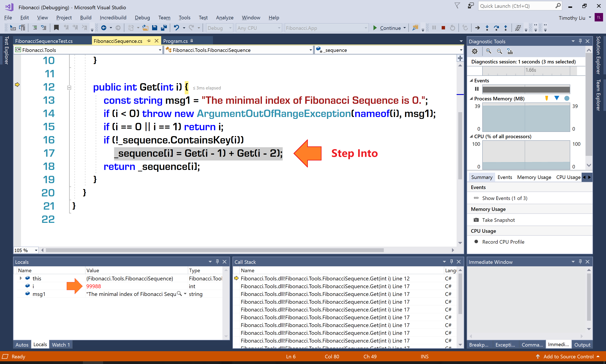
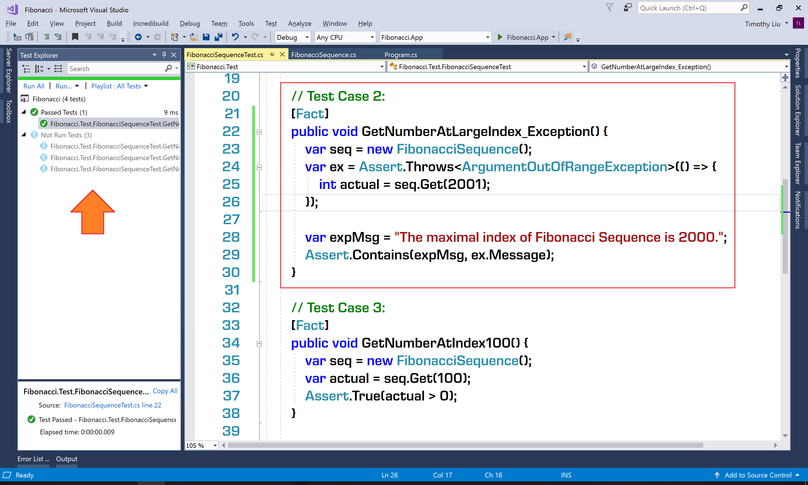

# Tutorial Lab - Fix Bug 2: Large Index Crashes the Application #

## Lab Overview ##

In Lesson 04, we learned how to debug and fix a bug that causes stack overflow. We called the problematic method (```Get```) from a unit test case. Eventually, we covered the fixed method with a new unit test case.

Bug 2 (Large index, for example ```100000```, crashes the application) is also about ```StackOverflowException```. So it should have big similarity with Bug 1. Now, it's your turn to fix this bug.

## Lab Guideline ##

### Start Point Project ###

The start point project is in the file ```$\Labs\Module 01\Lesson 04\Tutorial Lab - Fix Bug 2 Large Index Crashes the Application\Code\Start.zip```. It's equivalent to the ```Step02.zip``` of the lesson.

Please extract the ```Start.zip``` and open the ```Fibonacci``` solution in Visual Studio Community 2017.

### Debugging ###

Open the file ```FibonacciSequenceTest.cs``` of the ```Fibonacci.Test``` project. Set a breakpoint on the code line ```seq.Get(100000);``` of the test case ```GetNumberAtLargeIndex```.

Debug (not run) the test case ```GetNumberAtLargeIndex```. When the execution hits the breakpoint, press <kbd>F11</kbd> to step into the ```Get``` method.

Still, alternately use <kbd>F10</kbd> (Step Over) and <kbd>F11</kbd> (Step Into) to execute the code. When entering each level of the call stack, please observe the value of the parameter ```i```:



Soon, you will find that each time we call the ```Get``` method recursively, the value of ```i``` decreases ```1```. If the value of ```i``` starts from ```100000```, to reach the base case ```0``` and ```1``` the call stack will be as long as 100000 levels. While the memory of the application stack can only hold several thousands of function calls. Therefore, before the recursion reaches the base cases, the stack has already overflowed.

### Fixing the Bug ###

To fix this bug, we should set a proper upper boundary for the Fibonacci Sequence. Usually, the stack memory of an application running on common PC is sufficient to bear several thousands of function calls on the call stack. So, let's use ```2000``` as the upper boundary of the Fibonacci Sequence.

After the code is fixed, the ```Get``` method looks like:

```CS
public int Get(int i) {
    const string msg1 = "The minimal index of Fibonacci Sequence is 0.";
    const string msg2 = "The maximal index of Fibonacci Sequence is 2000.";
    if (i < 0) throw new ArgumentOutOfRangeException(nameof(i), msg1);
    if (i > 2000) throw new ArgumentOutOfRangeException(nameof(i), msg2);
    if (i == 0 || i == 1) return i;
    if (!_sequence.ContainsKey(i))
        _sequence[i] = Get(i - 1) + Get(i - 2);
    return _sequence[i];
}
```

And, we should create a new unit test case to cover the change made for fixing Bug 2:

```CS
// Test Case 2:
[Fact]
public void GetNumberAtLargeIndex_Exception() {
    var seq = new FibonacciSequence();
    var ex = Assert.Throws<ArgumentOutOfRangeException>(() => {
        int actual = seq.Get(2001);
    });

    var expMsg = "The maximal index of Fibonacci Sequence is 2000.";
    Assert.Contains(expMsg, ex.Message);
}
```

Run the test case. It should be passed:



You can find the source code so far in the file ```$\Labs\Module 01\Lesson 04\Tutorial Lab - Fix Bug 2 Large Index Crashes the Application\Code\Finished.zip```.
