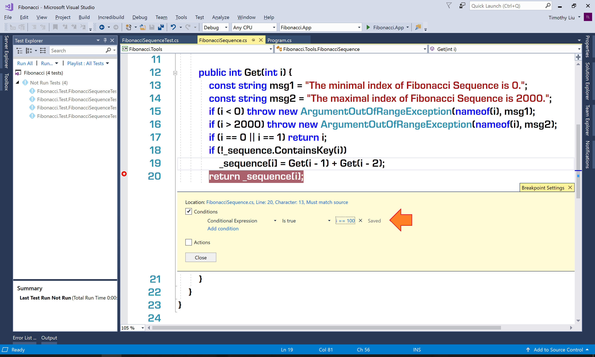
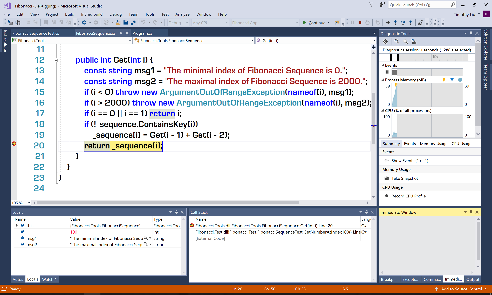
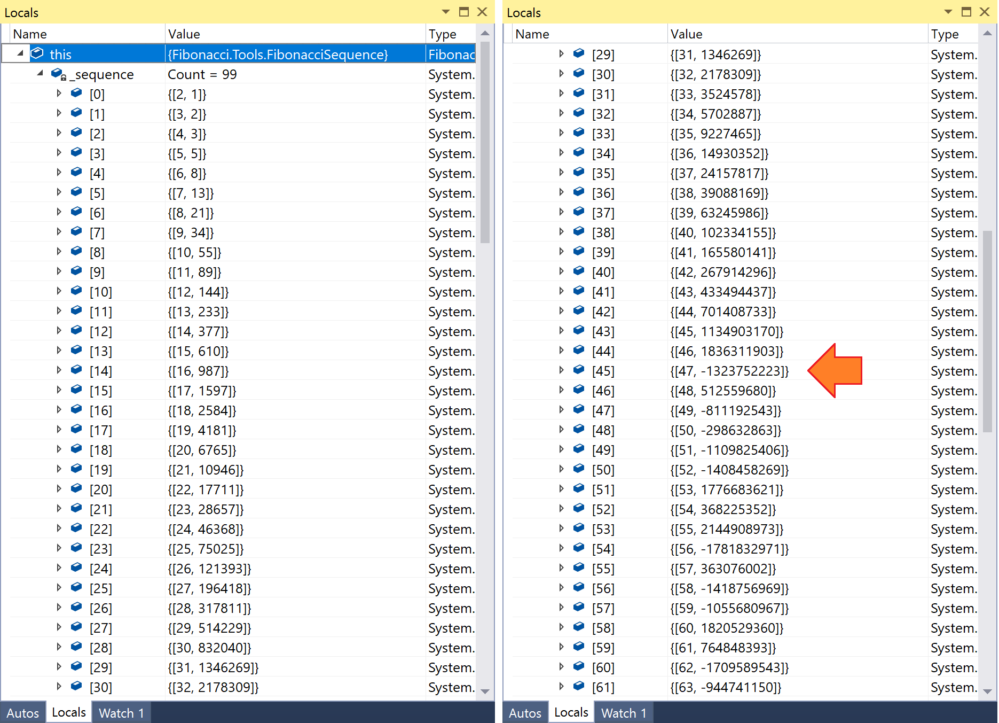
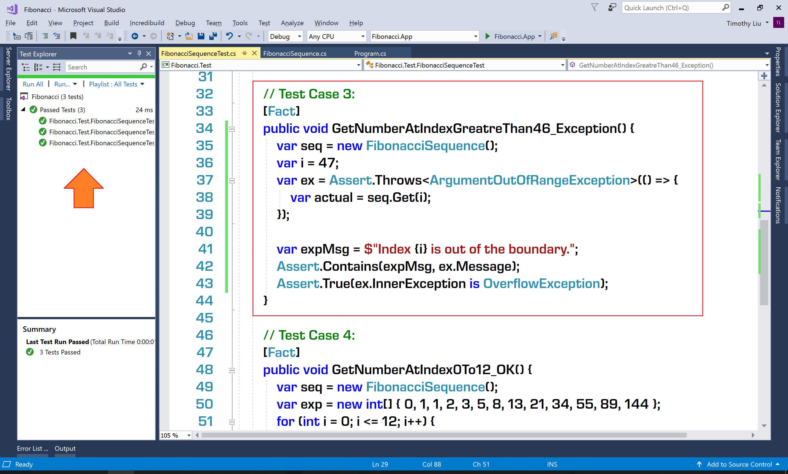

# Tutorial Lab - Fix Bug 3: The Fibonacci Number at the Index ```100``` is Negative #

## Lab Overview ##

In this lab, we are going to fix Bug 3 (The Fibonacci Number at the Index ```100``` is Negative) and refactor the code to compact the logic.

## Lab Guideline ##

### Start Point Project ###

The start point project is in the file ```$\Labs\Module 01\Lesson 04\Tutorial Lab - Fix Bug 3 The Fibonacci Number at the Index 100 is Negative\Code\Start.zip```. It's equivalent to the ```Finished.zip``` of the last tutorial lab (Fix Bug 3: The Fibonacci Number at the Index ```100``` is Negative).

### Debugging ###

Since the only clue is the return value of ```Get(100)``` is negative, we should set a conditional breakpoint on the ```return``` statement of the ```Get``` method, then set the condition to ```i == 100```:



Debug (not run) the Test Case 3 and let the execution hit the conditional breakpoint:



In the Locals panel, expand ```this```, then expand ```_sequence```. Observe the index-number pair stored in the dictionary object. When scrolling down to the index ```47```, the first negative number appears. After the index ```47```, there are more and more negative numbers since each number is the sum of the two preceding numbers.



Then we have to ask ourselves a question: why the number at index ```47``` is negative? The answer is *overflow*. But this overflow is not stack overflow - it's a overflow of value storage. Since the .NET Core application will use 4 bytes (32 bits) of memory to store an ```int``` (or say ```System.Int32```) instance, and ```int``` is a signed type, so the maximal value an ```int``` instance can present is ```2^31```. This value is ```2147483647```. You can use ```int.MaxValue``` to get this value quickly.

As we know, the number at index ```47``` should be the sum of the numbers on indexed ```46``` and ```45```. The numbers on index ```46``` and ```45``` are ```1836311903``` and ```1134903170```. If add these two numbers up in calculator, the sum should be ```2971215073```, which is greater that the maximal positive value an ```int``` variable can hold. Therefore, the overflow happened.

To improve the performance of the application and enable the infinite counter loops, .NET Core code runs in a *unchecked* context by default. When running in unchecked context, the .NET runtime won't throw exception for the value overflow.

### Fixing the Bug ###

After figuring out the root cause of the bug. We have two solutions to fix the bug:
* **Solution 1**: lower the upper boundary of the Fibonacci Sequence from 2000 to 44.
* **Solution 2**: let the code run in *checked* context and throw exception for overflow.

If we choose Solution 1, in the future, if we decide to upgrade the type of the Fibonacci Number from ```int``` to ```long``` to increase its capacity, we have to raise the upper boundary again. If we choose Solution 2, there won't be this potential problem. So we choose Solution 2.

After fixing the bug, the code of ```Get``` method is:

```CS
public int Get(int i) {
    const string msg1 = "The minimal index of Fibonacci Sequence is 0.";
    if (i < 0) throw new ArgumentOutOfRangeException(nameof(i), msg1);
    if (i == 0 || i == 1) return i;
    try {
        checked {
            if (!_sequence.ContainsKey(i))
                _sequence[i] = Get(i - 1) + Get(i - 2);
        }
    } catch (OverflowException ex) {
        string msg2 = $"Index {i} is out of the boundary.";
        throw new ArgumentOutOfRangeException(msg2, ex);
    }
    return _sequence[i];
}
```

Since the fix for Bug 3 contains the fix for Bug 2, we removed the fix for Bug 2 from the code and also removed the Test Case 2 for covering the fix for Bug 2.

Then, we add a new unit test case to cover the change for fixing both Bug 2 and Bug 3:

```CS
// Test Case 3:
[Fact]
public void GetNumberAtIndexGreatreThan46_Exception() {
    var seq = new FibonacciSequence();
    var i = 47;
    var ex = Assert.Throws<ArgumentOutOfRangeException>(() => {
        var actual = seq.Get(i);
    });

    var expMsg = $"Index {i} is out of the boundary.";
    Assert.Contains(expMsg, ex.Message);
    Assert.True(ex.InnerException is OverflowException);
}
```

Now, all test cases should be passed:



You can find the source code so far in the file ```$\Labs\Module 01\Lesson 04\Tutorial Lab - Fix Bug 3 The Fibonacci Number at the Index 100 is Negative\Code\Finished.zip```.
