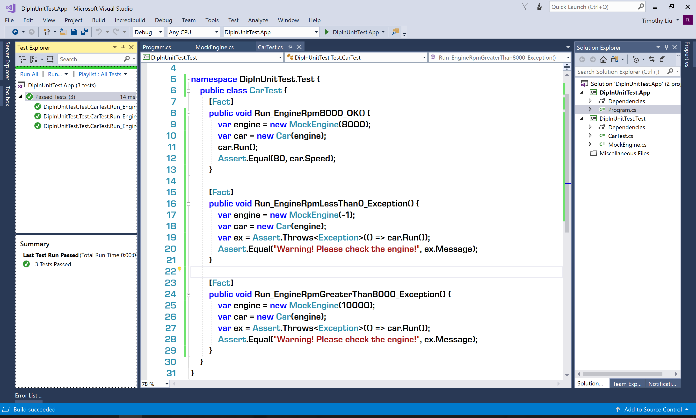
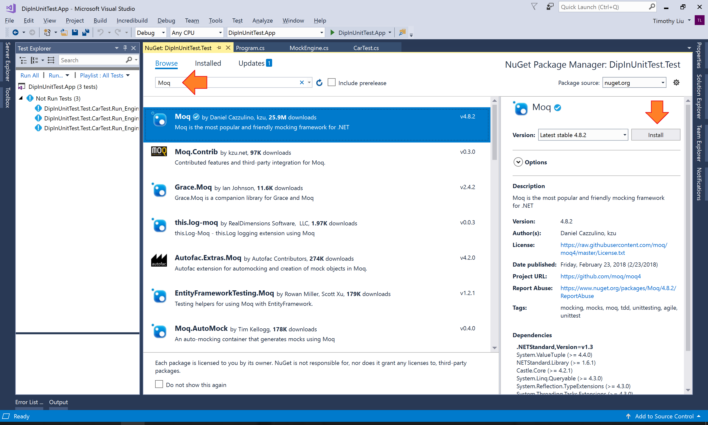
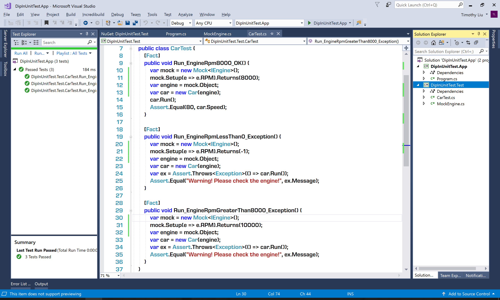

# Tutorial Lab - Using DIP in Unit Test #

## Lab Overview ##

In the lesson, we learned what DIP is and how to leverage DIP to decouple the service consumer and service. In this lab, we will see how to leverage DIP in unit test to make the test cases more efficient.

## Lab Guideline ##

### Start Point Project ###

You can find the code of the start point project in the file ```$\Labs\Module 02\Lesson 01\Code\Start.zip```.

After extracting the zip file and opening the solution in Visual Studio Community 2017, open the file ```Program.cs``` of the ```DipInUnitTest.App``` project. There are two tightly coupled classes ```Car``` and ```Engine```:

```CS
public class Engine {
    public int RPM { get; }
    public void Start() { /*implementation ...*/ }
    public void Work() { /*implementation ...*/ }
    public void Stop() { /*implementation ...*/ }
}

public class Car {
    private Engine _engine;
    public Car(Engine engine) {
        _engine = engine;
    }

    public int Speed { get; set; }
    public void Run() {
        if (_engine.RPM >= 0 && _engine.RPM <= 8000) {
            Speed = _engine.RPM / 100;
            Console.WriteLine($"Running at speed {Speed} MPH ...");
        } else {
            throw new Exception("Warning! Please check the engine!");
        }
    }
}
```

For some reasons, the implementation of the ```Engine``` class has some issues. Especially, these issues can impact the value of the ```RPM```. Since the class ```Car``` depends on the class ```Engine```, if the behaviors of the ```Engine``` class is not correct, the behaviors of the ```Car``` cannot be correct. Therefore, even the code of the ```Car``` class is correct, we can not prove it with unit test.

### Decoupling with DIP ###

Let's introduce the ```IEngine``` interface to decouple the class ```Car``` and the class ```Engine```:

```CS
public interface IEngine {
    int RPM { get; }
    void Start();
    void Work();
    void Stop();
}

public class Engine : IEngine {
    public int RPM { get; }
    public void Start() { /*implementation ...*/ }
    public void Work() { /*implementation ...*/ }
    public void Stop() { /*implementation ...*/ }
}

public class Car {
    private IEngine _engine;
    public Car(IEngine engine) {
        _engine = engine;
    }

    public int Speed { get; set; }
    public void Run() {
        if (_engine.RPM >= 0 && _engine.RPM <= 8000) {
            Speed = _engine.RPM / 100;
            Console.WriteLine($"Running at speed {Speed} MPH ...");
        } else {
            throw new Exception("Warning! Please check the engine!");
        }
    }
}
```

As we see, the changes are:
* The ```Engine``` class implemented the ```IEngine``` interface.
* The type of the ```_engine``` field of the ```Car``` class changed to ```IEngine```. The type of the constructor parameter changed too.

In short word, after applying DIP, ```Car``` no longer depends on ```Engine```. Both ```Car``` and ```Engine``` depend on ```IEngine```.

### Unit Test with Mock Classes ###

Create an xUnit test project named ```DipInUnitTest.Test```, then add reference to the ```DipInUnitTest.App``` for the ```DipInUnitTest.Test``` project. Change the file ```UnitTest1.cs``` to ```CarTest.cs```, also change the test class name from ```UnitTest1``` to ```CarTest```.

Since we've already applied DIP, whether the ```Engine``` class has issues or not, we should create a mock class which implements the ```IEngine``` interface and stably provides the values we need for the unit test. So, we add the class below to the unit test project:

```CS
class MockEngine : IEngine {
    int _rpm;
    public MockEngine(int rpm) {
        _rpm = rpm;
    }

    public int RPM { get { return _rpm; } }
    public void Start() { }
    public void Stop() { }
    public void Work() { }
}
```

Change the unit test case name from ```Test1``` to ```Run_EngineRpm8000_OK```. The code of the test case is:

```CS
[Fact]
public void Run_EngineRpm8000_OK() {
    var engine = new MockEngine(8000);
    var car = new Car(engine);
    car.Run();
    Assert.Equal(80, car.Speed);
}
```

Run the test case. You should see it is passed.

Then, add another two test cases:

```CS
[Fact]
public void Run_EngineRpmLessThan0_Exception() {
    var engine = new MockEngine(-1);
    var car = new Car(engine);
    var ex = Assert.Throws<Exception>(() => car.Run());
    Assert.Equal("Warning! Please check the engine!", ex.Message);
}

[Fact]
public void Run_EngineRpmGreaterThan8000_Exception() {
    var engine = new MockEngine(10000);
    var car = new Car(engine);
    var ex = Assert.Throws<Exception>(() => car.Run());
    Assert.Equal("Warning! Please check the engine!", ex.Message);
}
```

Run all the test cases, they should be passed:



You can find the source code so far in the file ```$\Labs\Module 02\Lesson 01\Tutorial Lab - Using DIP in Unit Test\Code\Step01.zip```.

### Mocking Frameworks ###

As we see, we created the ```MockEngine``` class to provide the values we need for the unit test. You may notice that with the service class (```Engine```) more and more complex, its output values and value combinations will be more and more. If we keep creating mock classes for each output or output combination, there will be too many mock classes in the unit test project.

To resolve this problem, we can use *Mock Frameworks*. The most popular mocking framework for .NET Core is [Moq](https://github.com/moq/moq). Now let's try to use Moq to mock the ```Engine``` class.

Right-click the ```DipInUnitTest.Test``` project, the click <kbd>Manage NuGet Packages...</kbd>. Browse and install the **Moq** package:



Then, remove the ```MockEngine``` class from the unit test class. You should see there are some compilation errors caused by the missing of the ```MockEngine``` class.

Now, let's use mock framework to fill the hole. Wherever needs an ```IEngine``` type instance, we use the code below to create the mock instance:

```CS
var mock = new Mock<IEngine>();
mock.Setup(e => e.RPM).Returns(/*the RPM value*/);
var engine = mock.Object;
```

After fixing the errors, the code of test cases should be:

```CS
[Fact]
public void Run_EngineRpm8000_OK() {
    var mock = new Mock<IEngine>();
    mock.Setup(e => e.RPM).Returns(8000);
    var engine = mock.Object;
    var car = new Car(engine);
    car.Run();
    Assert.Equal(80, car.Speed);
}

[Fact]
public void Run_EngineRpmLessThan0_Exception() {
    var mock = new Mock<IEngine>();
    mock.Setup(e => e.RPM).Returns(-1);
    var engine = mock.Object;
    var car = new Car(engine);
    var ex = Assert.Throws<Exception>(() => car.Run());
    Assert.Equal("Warning! Please check the engine!", ex.Message);
}

[Fact]
public void Run_EngineRpmGreaterThan8000_Exception() {
    var mock = new Mock<IEngine>();
    mock.Setup(e => e.RPM).Returns(10000);
    var engine = mock.Object;
    var car = new Car(engine);
    var ex = Assert.Throws<Exception>(() => car.Run());
    Assert.Equal("Warning! Please check the engine!", ex.Message);
}
```

Run all the test cases, they should be passed:



You can find the source code so far in the file ```$\Labs\Module 02\Lesson 01\Tutorial Lab - Using DIP in Unit Test\Code\Finished.zip```

If you are interested to learn more about Moq, here is the [Quickstart](https://github.com/Moq/moq4/wiki/Quickstart) documentation of Moq.
